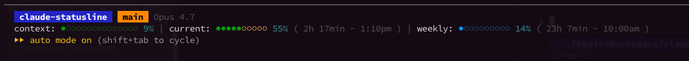
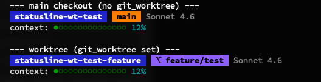

# claude-statusline

A rich statusline for [Claude Code](https://docs.anthropic.com/en/docs/claude-code) that shows your directory, git status, model, and usage limits at a glance.



## Features

| Line | Segments |
|------|----------|
| **Line 1** | Directory, git branch with ahead/behind + `+N -M` lines + untracked count, model name |
| **Line 2** | Context window usage bar with absolute token counts (e.g. `118k/1m`), 5-hour usage dot bar, 7-day usage dot bar, countdown + absolute reset time |

All data comes from the JSON that Claude Code pipes to the statusline script on stdin. **No API calls, no auth tokens, no caching.**

### Worktree indicator

When Claude Code is running inside a [linked git worktree](https://git-scm.com/docs/git-worktree), the branch chip switches from orange to purple and is prefixed with `⎇`, so you can tell at a glance whether you're on the main checkout or a worktree branch:



This is driven by the `workspace.git_worktree` field in Claude Code's stdin JSON — which is populated whenever the session's current directory is inside a linked worktree (not the main repo). The directory chip on the left already shows the worktree's folder name, so the colored branch chip just adds the "this is a worktree branch" signal without taking extra horizontal space.

### Dot colors

Each bar colors its **filled dots (●)** differently, depending on what the bar is measuring:

**Context bar — per-dot gradient.** Each filled dot's color reflects the usage level its position represents, so the bar visually scales from green (low) to red (full):

| Dot position | Color |
|--------------|-------|
| 0-49% | Green |
| 50-69% | Orange |
| 70-89% | Yellow |
| 90%+ | Red |

**5-hour / 7-day bars — pace coloring.** Filled dots are a single color reflecting how fast you're consuming quota relative to time elapsed in the window:

| Pace delta | Color | Meaning |
|------------|-------|---------|
| Below pace | Blue | Under pace (healthy buffer) |
| 0-20% above | Green | Within 20% of pace (on track) |
| 20-50% above | Yellow | Outpacing |
| 50%+ above | Red | Significantly outpacing |

**Empty dots (○) — all bars.** Colored by overall usage:

| Usage | Color |
|-------|-------|
| <50% | Dim |
| 50-69% | Orange |
| 70-89% | Yellow |
| 90%+ | Red |

## Prerequisites

- [Claude Code](https://docs.anthropic.com/en/docs/claude-code) CLI
- [`jq`](https://jqlang.github.io/jq/) — JSON processor
- `git` — for branch/diff info (pre-installed on most systems)

## Install

### Quick install

```bash
git clone git@github.com:TheBabaYaga/claude-statusline.git
cd claude-statusline
./install.sh
```

The install script will:
1. Install `jq` if missing (via Homebrew, apt, dnf, or pacman)
2. Copy `statusline-command.sh` to `~/.claude/`
3. Configure `~/.claude/settings.json` with the statusline command

### Manual install

1. Install `jq`:

   ```bash
   # macOS
   brew install jq

   # Debian/Ubuntu
   sudo apt-get install jq

   # Fedora
   sudo dnf install jq

   # Arch
   sudo pacman -S jq
   ```

2. Copy the script:

   ```bash
   cp statusline-command.sh ~/.claude/statusline-command.sh
   chmod +x ~/.claude/statusline-command.sh
   ```

3. Add to `~/.claude/settings.json`:

   ```json
   {
     "statusLine": {
       "type": "command",
       "command": "bash ~/.claude/statusline-command.sh"
     }
   }
   ```

4. Restart Claude Code.

### Updating

```bash
git pull && ./install.sh
```

## How it works

Claude Code invokes the statusline script after every response and pipes it a JSON payload on stdin containing the current directory, model, context-window usage, and rate-limit state (percentages and reset epochs for the 5-hour and 7-day windows). The script reads that JSON with `jq`, runs `git` locally for branch stats, and prints a formatted string.

- **No network access.** The script never contacts Anthropic (or anything else).
- **No credentials.** No OAuth token, keychain lookup, or API key is read.
- **Input is validated.** The working directory is rejected unless it's an absolute path, and rate-limit numbers are rejected unless they're plain non-negative integers — so nothing untrusted reaches shell arithmetic.

The `rate_limits` block is only populated for Claude.ai Pro/Max subscribers after the first API response; if it's absent, the 5-hour and 7-day bars are simply omitted.

## License

MIT
