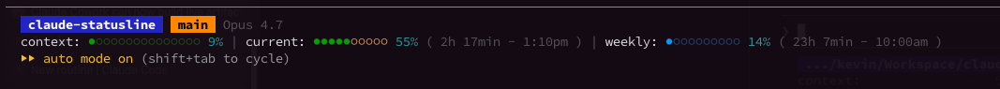
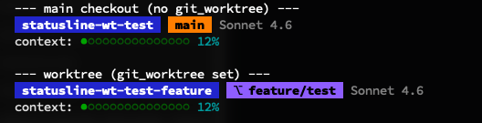

# claude-statusline

A rich statusline for [Claude Code](https://docs.anthropic.com/en/docs/claude-code) that shows your directory, git status, model, and usage limits at a glance.



There are two versions:

| Version | What it is | Where it shows |
|---------|------------|----------------|
| v1 | A shell script that Claude Code runs as its `statusLine` command | The terminal, below the prompt |
| v2 | A Claude Code mod in [`mod/`](mod) | The terminal and the Claude Desktop Code tab, above the prompt |

The sections from [Features](#features) to [Updating](#updating) describe v1. For v2, go to [v2: mod for the terminal and Claude Desktop](#v2-mod-for-the-terminal-and-claude-desktop). The release notes are in [CHANGELOG.md](CHANGELOG.md).

## Features

| Line | Segments |
|------|----------|
| **Line 1** | Directory, git branch with ahead/behind + `+N -M` lines + untracked count, model name + reasoning effort level |
| **Line 2** | Context window usage bar with absolute token counts (e.g. `118k/1m`), 5-hour usage dot bar, 7-day usage dot bar, countdown + absolute reset time |

All data comes from the JSON that Claude Code pipes to the statusline script on stdin. **No API calls, no auth tokens, no caching.**

### Worktree indicator

When Claude Code is running inside a [linked git worktree](https://git-scm.com/docs/git-worktree), the branch chip switches from orange to purple and is prefixed with `⎇`, so you can tell at a glance whether you're on the main checkout or a worktree branch:



This is driven by the `workspace.git_worktree` field in Claude Code's stdin JSON — which is populated whenever the session's current directory is inside a linked worktree (not the main repo). The directory chip on the left already shows the worktree's folder name, so the colored branch chip just adds the "this is a worktree branch" signal without taking extra horizontal space.

### Effort level

When the active model supports a reasoning effort setting, the level is shown in cyan right after the model name, separated by a dim `·` (e.g. `Opus 4.8 · high`). This is driven by the `effort.level` field in Claude Code's stdin JSON. If the field is absent — because the model doesn't expose an effort setting — nothing is added and only the model name is shown.

### Dot colors

Each bar colors its **filled dots (●)** differently, depending on what the bar is measuring:

**Context bar — per-dot gradient.** Each filled dot's color reflects the usage level its position represents, so the bar visually scales from green (low) to red (full):

| Dot position | Color |
|--------------|-------|
| 0-49% | Green |
| 50-69% | Orange |
| 70-89% | Yellow |
| 90%+ | Red |

**5-hour / 7-day bars — pace coloring.** Filled dots are a single color reflecting how fast you're consuming quota relative to time elapsed in the window:

| Pace delta | Color | Meaning |
|------------|-------|---------|
| Below pace | Blue | Under pace (healthy buffer) |
| 0-20% above | Green | Within 20% of pace (on track) |
| 20-50% above | Yellow | Outpacing |
| 50%+ above | Red | Significantly outpacing |

**Empty dots (○) — all bars.** Colored by overall usage:

| Usage | Color |
|-------|-------|
| <50% | Dim |
| 50-69% | Orange |
| 70-89% | Yellow |
| 90%+ | Red |

## Prerequisites

- [Claude Code](https://docs.anthropic.com/en/docs/claude-code) CLI
- [`jq`](https://jqlang.github.io/jq/) — JSON processor
- `git` — for branch/diff info (pre-installed on most systems)

## Install

### Quick install

```bash
git clone git@github.com:TheBabaYaga/claude-statusline.git
cd claude-statusline
./install.sh
```

The install script will:
1. Install `jq` if missing (via Homebrew, apt, dnf, or pacman)
2. Copy `statusline-command.sh` to `~/.claude/`
3. Configure `~/.claude/settings.json` with the statusline command

### Manual install

1. Install `jq`:

   ```bash
   # macOS
   brew install jq

   # Debian/Ubuntu
   sudo apt-get install jq

   # Fedora
   sudo dnf install jq

   # Arch
   sudo pacman -S jq
   ```

2. Copy the script:

   ```bash
   cp statusline-command.sh ~/.claude/statusline-command.sh
   chmod +x ~/.claude/statusline-command.sh
   ```

3. Add to `~/.claude/settings.json`:

   ```json
   {
     "statusLine": {
       "type": "command",
       "command": "bash ~/.claude/statusline-command.sh"
     }
   }
   ```

4. Restart Claude Code.

### Updating

```bash
git pull && ./install.sh
```

## v2: mod for the terminal and Claude Desktop

The [`mod/`](mod) folder holds v2: a Claude Code mod (a plugin of function hooks). Claude Desktop does not run a `statusLine` command, so v1 shows only in the terminal. v2 draws one line in the band above the prompt. That band shows in the terminal and in the Claude Desktop Code tab.

v2 uses the same colors as v1. It gets its data from the mod API, not from stdin JSON:

| Segment | Source |
|---------|--------|
| Directory, model | `$.session.cwd()`, `$.session.model()` |
| Effort level | the `turn.step` event (shows after the first model request) |
| Git chip | `git status --porcelain=v2`, `git diff --numstat` and `git rev-parse` through `$.process.run` |
| Context and rate-limit bars | `$.session.usage()` and the `session.measure` event |

The bars are smooth instead of dotted. Claude Desktop draws each bar as an SVG, exact to the pixel. The terminal draws it with block characters in 1/8-cell steps (`███▊░░░`). The colors follow the v1 rules. The context bar fills from `tokens / window`, so it is finer than a whole percent.

To fit on one line, v2 uses short labels (`ctx`, `5h`, `7d`). The line wraps between segments when the band is too narrow:

```text
 claude-statusline   feat/v2-mod +43 -0 ?9  Opus 5.5 · high | ctx ██▍░░░░░░░░░░░░ 16% 161k/1m | 5h ▎░░░░░░░░░ 3% ( 4h 21min - 2:00pm ) | 7d █░░░░░░░░░ 10% ( 4d 2h - Sun 12:00pm )
```

The mod refreshes after each turn, when usage changes, and every 30 seconds. It needs no `jq`.

### Install v2

1. Add the marketplace and install the plugin:

   ```bash
   claude plugin marketplace add TheBabaYaga/claude-statusline
   ```

   ```bash
   claude plugin install rich-statusline@thebabayaga
   ```

2. Start a new session.

In the terminal, the model name and the effort level are buttons. The model name opens `/model`, and the effort level opens `/effort`. Click a button in fullscreen mode, or press `ctrl+x tab` and then `m` for the model or `e` for the effort.

In the terminal, v1 and v2 both show if you keep the `statusLine` setting. Remove `statusLine` from `~/.claude/settings.json` to show only v2.

### Update v2

```bash
claude plugin marketplace update thebabayaga
```

```bash
claude plugin update rich-statusline@thebabayaga
```

Then start a new session.

### Develop v2

To run v2 from your clone, add the absolute path of its `mod` folder to `CLAUDE_CODE_PLUGIN_DIRS` in the `env` block of `~/.claude/settings.json`. Claude Desktop and the terminal both read this value. If you also installed v2 from the marketplace, uninstall that copy first. Otherwise two copies of v2 can load.

```json
{
  "env": {
    "CLAUDE_CODE_PLUGIN_DIRS": "/absolute/path/to/claude-statusline/mod"
  }
}
```

A change in `mod/` loads in your next session. To try it in one terminal session only, use `claude --plugin-dir ./mod`.

Check and test the mod:

```bash
claude plugin validate mod
```

```bash
claude plugin test mod
```

The layout rules are in [`mod/hooks/format.ts`](mod/hooks/format.ts). The hooks are in [`mod/hooks/register.tsx`](mod/hooks/register.tsx).

## How it works

Claude Code invokes the statusline script after every response and pipes it a JSON payload on stdin containing the current directory, model, context-window usage, and rate-limit state (percentages and reset epochs for the 5-hour and 7-day windows). The script reads that JSON with `jq`, runs `git` locally for branch stats, and prints a formatted string.

- **No network access.** The script never contacts Anthropic (or anything else).
- **No credentials.** No OAuth token, keychain lookup, or API key is read.
- **Input is validated.** The working directory is rejected unless it's an absolute path, and rate-limit numbers are rejected unless they're plain non-negative integers — so nothing untrusted reaches shell arithmetic.

v2 runs inside Claude Code. It reads the same data through the mod API and runs only `git` on your machine. It makes no network calls and reads no credentials.

The `rate_limits` block is only populated for Claude.ai Pro/Max subscribers after the first API response; if it's absent, the 5-hour and 7-day bars are simply omitted.

## License

MIT
